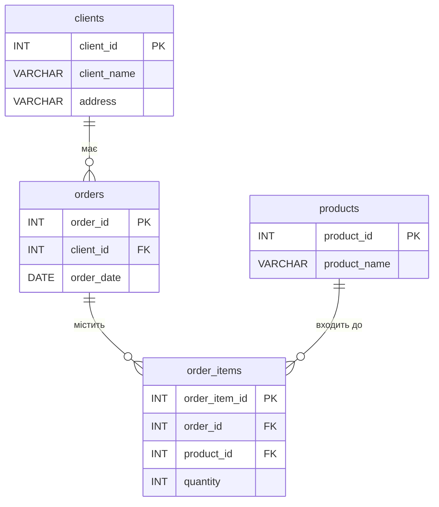

# goit-rdb-hw-02

## Початкова таблиця

| Номер_замовлення | Назва_товару і кількість | Адреса_клієнта | Дата_замовлення | Клієнт |
|---|---|---|---|---|
| 101 | Лептоп: 3, Мишка: 2 | Хрещатик 1 | 2023-03-15 | Мельник |
| 102 | Принтер: 1 | Басейна 2 | 2023-03-16 | Шевченко |
| 103 | Мишка: 4 | Комп'ютерна 3 | 2023-03-17 | Коваленко |

---

## Етап 1 — 1НФ

Порушення: колонка "Назва_товару і кількість" неатомарна. Розбиваємо на окремі рядки.

| Номер_замовлення | Назва_товару | Кількість | Адреса_клієнта | Дата_замовлення | Клієнт |
|---|---|---|---|---|---|
| 101 | Лептоп | 3 | Хрещатик 1 | 2023-03-15 | Мельник |
| 101 | Мишка | 2 | Хрещатик 1 | 2023-03-15 | Мельник |
| 102 | Принтер | 1 | Басейна 2 | 2023-03-16 | Шевченко |
| 103 | Мишка | 4 | Комп'ютерна 3 | 2023-03-17 | Коваленко |

PK: `(Номер_замовлення, Назва_товару)`

---

## Етап 2 — 2НФ

Порушення: `Адреса_клієнта`, `Дата_замовлення`, `Клієнт` залежать лише від `Номер_замовлення` (часткова залежність). Розбиваємо на дві таблиці.

**orders**

| order_id PK | Адреса_клієнта | Дата_замовлення | Клієнт |
|---|---|---|---|
| 101 | Хрещатик 1 | 2023-03-15 | Мельник |
| 102 | Басейна 2 | 2023-03-16 | Шевченко |
| 103 | Комп'ютерна 3 | 2023-03-17 | Коваленко |

**order_items**

| order_id FK | Назва_товару | Кількість |
|---|---|---|
| 101 | Лептоп | 3 |
| 101 | Мишка | 2 |
| 102 | Принтер | 1 |
| 103 | Мишка | 4 |

---

## Етап 3 — 3НФ

Порушення: `Адреса_клієнта` залежить від `Клієнт` (транзитивна залежність). Виділяємо `clients` та `products`.

**clients**

| client_id PK | client_name | address |
|---|---|---|
| 1 | Мельник | Хрещатик 1 |
| 2 | Шевченко | Басейна 2 |
| 3 | Коваленко | Комп'ютерна 3 |

**orders**

| order_id PK | client_id FK | order_date |
|---|---|---|
| 101 | 1 | 2023-03-15 |
| 102 | 2 | 2023-03-16 |
| 103 | 3 | 2023-03-17 |

**products**

| product_id PK | product_name |
|---|---|
| 1 | Лептоп |
| 2 | Мишка |
| 3 | Принтер |

**order_items**

| order_item_id PK | order_id FK | product_id FK | quantity |
|---|---|---|---|
| 1 | 101 | 1 | 3 |
| 2 | 101 | 2 | 2 |
| 3 | 102 | 3 | 1 |
| 4 | 103 | 2 | 4 |

---

## Етап 4 — ER-діаграма

---

## Етап 5 — DDL

[tables.sql](./tables.sql)
