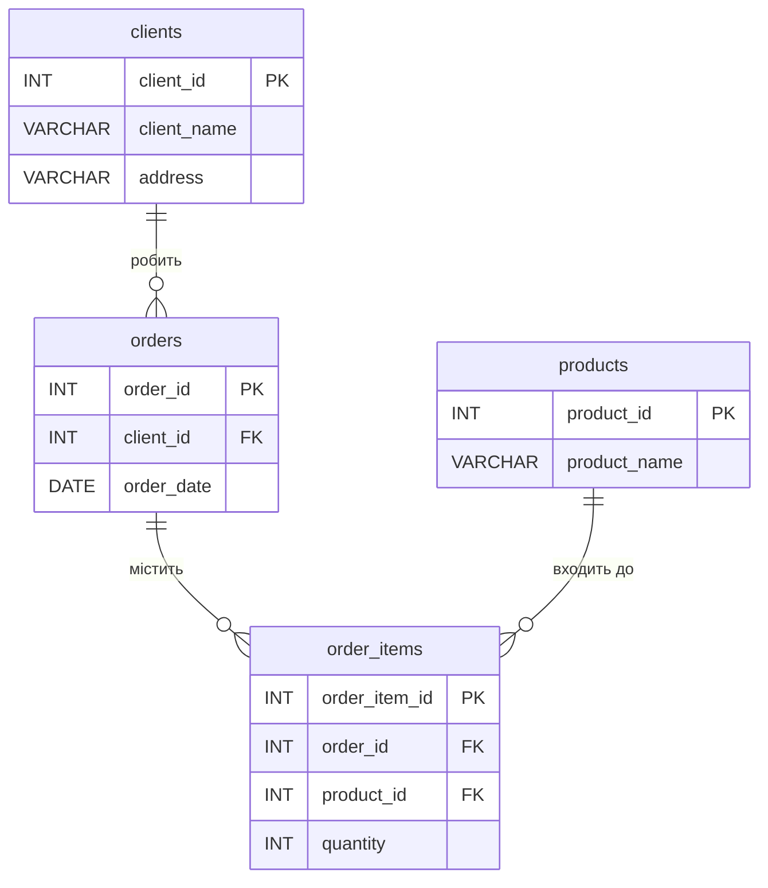

# goit-rdb-hw-02 — Проектування БД з використанням семантичних моделей

## Початкова таблиця

| Номер_замовлення | Назва_товару і кількість | Адреса_клієнта | Дата_замовлення | Клієнт |
|---|---|---|---|---|
| 101 | Лептоп: 3, Мишка: 2 | Хрещатик 1 | 2023-03-15 | Мельник |
| 102 | Принтер: 1 | Басейна 2 | 2023-03-16 | Шевченко |
| 103 | Мишка: 4 | Комп'ютерна 3 | 2023-03-17 | Коваленко |

---

## Етап 1 — Перша нормальна форма (1НФ)

**Порушення:** колонка "Назва_товару і кількість" є неатомарною — містить кілька значень в одній клітинці.

**Правило 1НФ:** кожна клітинка містить лише одне значення; кожен рядок унікальний.

**Рішення:** розбити складену колонку; кожен товар — окремий рядок. Складений первинний ключ: `(Номер_замовлення, Назва_товару)`.

| Номер_замовлення | Назва_товару | Кількість | Адреса_клієнта | Дата_замовлення | Клієнт |
|---|---|---|---|---|---|
| 101 | Лептоп | 3 | Хрещатик 1 | 2023-03-15 | Мельник |
| 101 | Мишка | 2 | Хрещатик 1 | 2023-03-15 | Мельник |
| 102 | Принтер | 1 | Басейна 2 | 2023-03-16 | Шевченко |
| 103 | Мишка | 4 | Комп'ютерна 3 | 2023-03-17 | Коваленко |

---

## Етап 2 — Друга нормальна форма (2НФ)

**Порушення:** `Адреса_клієнта`, `Дата_замовлення`, `Клієнт` залежать лише від `Номер_замовлення`, а не від всього складеного ключа `(Номер_замовлення, Назва_товару)` — **часткова залежність**.

**Правило 2НФ:** кожен неключовий атрибут повністю функціонально залежить від первинного ключа.

**Рішення:** розбити на дві таблиці.

### Таблиця `orders` (замовлення)

| order_id (PK) | Адреса_клієнта | Дата_замовлення | Клієнт |
|---|---|---|---|
| 101 | Хрещатик 1 | 2023-03-15 | Мельник |
| 102 | Басейна 2 | 2023-03-16 | Шевченко |
| 103 | Комп'ютерна 3 | 2023-03-17 | Коваленко |

### Таблиця `order_items` (позиції замовлення)

| order_id (FK) | Назва_товару | Кількість |
|---|---|---|
| 101 | Лептоп | 3 |
| 101 | Мишка | 2 |
| 102 | Принтер | 1 |
| 103 | Мишка | 4 |

---

## Етап 3 — Третя нормальна форма (3НФ)

**Порушення в `orders`:** `Адреса_клієнта` залежить від `Клієнт`, а не від `order_id` — **транзитивна залежність**: `order_id → Клієнт → Адреса_клієнта`.

**Порушення в `order_items`:** `Назва_товару` повторюється (Мишка — у двох рядках), що порушує принцип відсутності надлишковості.

**Правило 3НФ:** жоден неключовий атрибут не залежить транзитивно від первинного ключа.

**Рішення:** виділити `clients` та `products` в окремі таблиці.

### Таблиця `clients`

| client_id (PK) | client_name | address |
|---|---|---|
| 1 | Мельник | Хрещатик 1 |
| 2 | Шевченко | Басейна 2 |
| 3 | Коваленко | Комп'ютерна 3 |

### Таблиця `orders`

| order_id (PK) | client_id (FK) | order_date |
|---|---|---|
| 101 | 1 | 2023-03-15 |
| 102 | 2 | 2023-03-16 |
| 103 | 3 | 2023-03-17 |

### Таблиця `products`

| product_id (PK) | product_name |
|---|---|
| 1 | Лептоп |
| 2 | Мишка |
| 3 | Принтер |

### Таблиця `order_items`

| order_item_id (PK) | order_id (FK) | product_id (FK) | quantity |
|---|---|---|---|
| 1 | 101 | 1 | 3 |
| 2 | 101 | 2 | 2 |
| 3 | 102 | 3 | 1 |
| 4 | 103 | 2 | 4 |

---

## Етап 4 — ER-діаграма



---

## Етап 5 — Створення таблиць у БД

Файл [`tables.sql`](./tables.sql) містить DDL-скрипт для створення всіх таблиць з урахуванням зв'язків (FOREIGN KEY).

Для запуску в MySQL Workbench:
```sql
SOURCE /path/to/tables.sql;
```
